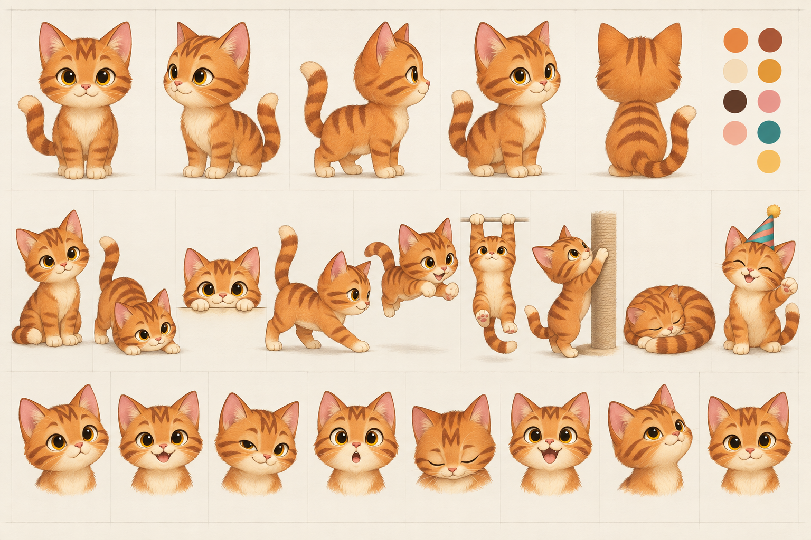

# Marmalade — Character Bible v1

Status: **foundation candidate for visual approval**. Do not begin final rigging until this identity is approved.

## Core character

Marmalade is a curious, mischievous, affectionate orange tabby kitten. He is clever enough to lead the story, cheeky enough to cause the next beat, and gentle enough to carry the emotional pauses. The drawing language is premium greeting-card illustration: warm, editorial, soft-edged and expressive, without becoming childish, mascot-like or photorealistic.

## Identity locks

- Slightly oversized rounded head; compact pear-shaped torso; short lower legs; small rounded paws.
- Large amber eyes with dark brown pupils and warm ivory catchlights.
- Warm orange coat, darker burnt-orange stripes, cream muzzle/chest/belly/paw tips.
- Symmetrical forehead **M**: three dark tapered strokes with the center descending lowest.
- Two cheek stripes on each side, angled toward the muzzle but never touching it.
- Three dorsal body stripes visible in side and three-quarter views.
- Ringed tail: four dark bands plus a dark tip; cream must not appear on the tail.
- Pink triangular nose, pink inner ears, three whiskers per cheek.
- Rounded cheeks and a shallow, friendly mouth line. No visible teeth except in an intentionally excited expression.

## Palette

| Token | Hex | Usage |
|---|---:|---|
| Marmalade orange | `#E8893A` | Primary coat |
| Burnt stripe | `#A94E2B` | Forehead, cheeks, limbs, back, tail |
| Warm cream | `#F7E3BE` | Muzzle, chest, belly, paw tips |
| Amber iris | `#D99A24` | Eyes |
| Deep brown | `#4A2C25` | Pupils, line accents, whisker roots |
| Nose rose | `#D97C78` | Nose and mouth accent |
| Inner-ear blush | `#E7A0A0` | Inner ears |
| Party teal | `#2E8C87` | Hat/ribbon primary |
| Party coral | `#F06F61` | Hat/ribbon secondary |
| Butter gold | `#F5C65B` | Pom-pom/confetti accent |
| Paper ivory | `#F6F0E4` | Foundation presentation background |

Color tolerance for authored artwork is ±3 RGB values. Web lighting may tint the composite, but source fills stay at the master values.

## Proportion guide

Use head height as `1H`.

- Standing height: `2.35H` from ear tips to floor.
- Head width: `1.08H`; head height excluding ears: `0.78H`.
- Torso: `0.92H` high × `0.88H` wide.
- Eye centers: `0.42H` apart; iris diameter `0.22H`.
- Ear height: `0.33H`; ear bases sit at the outer thirds of the skull.
- Front leg: `0.68H`; rear leg silhouette: `0.62H`.
- Paw width: `0.22H`; tail visible length: `1.25H`; tail thickness: `0.13H` at base tapering to `0.08H`.
- Party hat: `0.58H` high; anchor centered `0.06H` behind the forehead plane.

Foreshortening may change projected lengths, never the underlying ratios. Squash is capped at 8%; stretch at 12% for ordinary actions and 16% for the pounce apex.

## Fixed marking map

1. Forehead M remains centered between the ears and above the brow line.
2. Cheek stripes follow the cheek volume; they do not drift toward the eyes or muzzle.
3. Front legs each carry two outer bands. Rear thighs carry two broad bands.
4. Three tapered stripes cross the upper back. Their spacing stays even from shoulder to rump.
5. Tail bands follow the tail mesh and preserve count through deformation.
6. Cream chest forms a soft inverted teardrop. Cream belly continues beneath it without climbing the flanks.
7. Cream paw tips end below the wrist/ankle joints, keeping joint seams inside orange fur.

## Expression rules

- **Curious:** pupils track first, then head, then one ear; mouth neutral.
- **Happy:** lower lids rise slightly, cheeks lift, small open smile.
- **Mischievous:** asymmetric eyelids, one cheek raised, tail tip hooks.
- **Surprised:** pupils widen, ears perk, muzzle compresses; no extreme jaw drop.
- **Sleepy:** upper lids at 65–85%, ears relaxed outward, low head carriage.
- **Excited:** wide eyes, lifted chest, open smile, fast tail tip.
- **Proud:** upright chest, half-smile, tail in a calm question-mark curve.
- **Gentle:** slow blink, relaxed ears, soft closed mouth.

## Consistency checklist

Before accepting new art, compare it directly with the master sheet:

- same face and eye spacing;
- same head-to-body ratio and silhouette;
- identical forehead M, cheek stripe count, dorsal stripe count and tail rings;
- identical cream boundaries;
- no cross-piece baked shadows;
- no texture dense enough to expose seams during deformation;
- pose reads in silhouette at 160 px high.

## Master asset

`assets/character/marmalade-master-sheet-v1.png` is the visual reference for v1. It is concept/model-sheet art, not a web-delivery sprite or a substitute for separated vector rig artwork.
